# Laporan UAS Sistem Paralel dan Terdistribusi

## Distributed Pub-Sub Log Aggregator

**Nama:** Naufal Tiarana Putra  
**NIM:** 11231071  
**Kelas:** A  
**Program Studi:** Informatika  
**Dosen Pengampu:** Riska Kurniyanto Abdullah, S.T., M.Kom.  
**Repository GitHub:** [distributed-pubsub-log-aggregator](https://github.com/Naufalpc11/distributed-pubsub-log-aggregator)<br>
**Video Demo:** [[UAS Sistem Paralel dan Terdistribusi | Distributed Pub-Sub Log Aggregator](https://youtu.be/0Zx_AZ8Mvdc)]

---

## Abstrak

Proyek ini membangun *Distributed Pub-Sub Log Aggregator* menggunakan FastAPI,
Redis Streams, PostgreSQL, dan Docker Compose. API menerima event tunggal atau
batch, kemudian menempatkannya pada Redis Stream untuk diproses oleh dua
consumer worker secara paralel. Idempotency dan deduplication dijamin secara
persisten melalui unique constraint `(topic, event_id)` dan pola SQL `INSERT
... ON CONFLICT DO NOTHING` di dalam transaksi PostgreSQL. Worker hanya
memberikan ACK setelah transaksi berhasil. Message yang gagal tetap berada
pada *Pending Entries List*, diambil kembali menggunakan `XAUTOCLAIM`, diberi
retry dengan exponential backoff, dan dipindahkan ke dead-letter stream
setelah batas percobaan tercapai.

Pengujian mencakup 30 unit/integration tests, uji konkurensi 20 pemrosesan
simultan terhadap event yang sama, uji persistence dengan recreate container
PostgreSQL, serta fault injection untuk retry dan dead-letter. Load test k6
mengirim 20.000 event dengan 30% duplikat menggunakan 20 virtual users. Hasil
menunjukkan 100% check berhasil, 0% HTTP failure, 14.000 event unik, dan 6.000
duplikat yang ditolak. Sistem juga menyediakan health, readiness, statistics,
queue lag, pending count, duplicate rate, throughput, audit log, dan named
volumes. Seluruh service berjalan pada jaringan lokal Docker Compose tanpa
ketergantungan layanan eksternal publik.

**Kata kunci:** distributed system, publish-subscribe, idempotency,
deduplication, transaction, concurrency, Redis Streams, PostgreSQL.

---

## 1. Pendahuluan

### 1.1 Latar Belakang

Sistem pengumpulan log menerima event dari banyak producer dan berpotensi
menghadapi pengiriman ulang, kegagalan jaringan, restart consumer, serta
pemrosesan paralel. Pada mekanisme *at-least-once delivery*, event yang sama
dapat diterima lebih dari sekali. Tanpa idempotency, duplikat dapat
menghasilkan data ganda, statistik yang salah, atau side effect yang berulang.
Masalah menjadi lebih sulit saat beberapa worker mencoba menyimpan event yang
sama secara bersamaan karena pengecekan biasa sebelum insert rentan terhadap
race condition.

Sistem terdistribusi juga memiliki karakteristik komunikasi asynchronous,
concurrent execution, dan independent failure. Oleh sebab itu, correctness
tidak dapat bergantung pada urutan eksekusi ideal atau asumsi bahwa semua
komponen selalu tersedia. Rancangan harus menempatkan jaminan konsistensi pada
mekanisme atomik, menyediakan recovery, dan mempertahankan data di luar siklus
hidup container (Microsoft, 2026a; Docker, Inc., 2026b).

Proyek ini menerapkan prinsip tersebut dalam bentuk log aggregator
multi-service. Redis Streams memisahkan penerimaan dan pemrosesan event,
sedangkan PostgreSQL menjadi sumber kebenaran persisten. Unique constraint,
transaction, audit log, retry, pending recovery, dead-letter, healthcheck, dan
observability digunakan untuk menghasilkan perilaku yang dapat diuji.

### 1.2 Tujuan

Tujuan proyek adalah:

1. Membangun arsitektur Pub-Sub multi-service menggunakan Docker Compose.
2. Menyediakan API single dan batch event dengan validasi schema.
3. Menjamin event `(topic, event_id)` diproses maksimal satu kali pada storage.
4. Mencegah race condition saat dua worker memproses event yang sama.
5. Mempertahankan data setelah restart atau recreate container.
6. Menyediakan retry, pending recovery, dead-letter, logging, dan metrics.
7. Membuktikan correctness melalui automated tests dan load test 20.000 event.

### 1.3 Batasan

Sistem berjalan pada satu Docker host dan satu instance PostgreSQL serta Redis.
Sistem tidak menyediakan total ordering atau strict per-topic ordering.
Security difokuskan pada isolasi jaringan lokal Compose dan non-root
application image; authentication, TLS, multi-host replication, dan
production-grade secret management berada di luar cakupan proyek.

---

# 2. Bagian Teori

## T1. Karakteristik Sistem Terdistribusi dan Trade-off Desain Pub-Sub

Sistem terdistribusi pada proyek ini terdiri dari API, Redis, PostgreSQL, dan
worker yang berjalan sebagai service berbeda di Docker Compose. Karakteristik
utamanya adalah komunikasi lewat jaringan, eksekusi concurrent, failure
independen, serta state yang tersebar. Microsoft Learn menjelaskan bahwa
aplikasi cloud/distributed sering perlu mengirim event antar-komponen, dan
direct communication membuat sender harus mengetahui endpoint setiap consumer
serta menangani kegagalan masing-masing consumer (Microsoft, 2026a).

Pub-Sub mengurangi coupling dengan menempatkan broker di tengah. API cukup
mempublikasikan event ke Redis Stream, sementara dua worker mengambil event
secara paralel. Trade-off-nya adalah hasil tidak langsung tersedia setelah
`202 Accepted`, delivery dapat terjadi lebih dari sekali, dan ordering selesai
tidak selalu sama dengan ordering masuk. Broker juga menjadi komponen baru
yang harus dipersistenkan dan dipantau.

Rancangan ini dipilih karena log aggregator lebih membutuhkan throughput,
decoupling, dan toleransi restart worker daripada respons sinkron yang
langsung menunggu database. Trade-off Pub-Sub dikendalikan dengan unique
constraint `(topic, event_id)`, transaksi PostgreSQL, ACK setelah commit,
pending recovery, dan dead-letter. Dengan demikian, sistem menerima sifat
asynchronous distributed system, tetapi tetap menjaga invariant data pada
batas transaksi yang jelas.

## T2. Alasan Memilih Publish-Subscribe Dibanding Client-Server

Client-server cocok ketika client membutuhkan hasil operasi secara langsung
dari satu server. Namun pada log ingestion, producer biasanya hanya perlu
menyerahkan event dengan cepat dan tidak harus menunggu semua efek downstream
selesai. Azure Architecture Center membedakan command dan event; event
menginformasikan bahwa sesuatu telah terjadi, sedangkan command meminta aksi
spesifik dan sering memiliki kebutuhan transaksi lebih ketat (Microsoft,
2026b). Event log pada proyek ini lebih alami diproses sebagai event
asynchronous.

Dengan Pub-Sub, publisher tidak mengetahui jumlah worker, alamat worker, atau
status pemrosesan internal. API menulis ke Redis Stream, lalu worker membaca
dari consumer group. Ketika worker ditambah atau direstart, publisher tidak
berubah. Pola ini juga mendukung burst traffic: API dapat menerima event lebih
cepat daripada kemampuan worker menyelesaikan transaksi, selama antrean dan
storage cukup.

Kelemahannya adalah observability dan reliability harus dirancang eksplisit.
Client tidak boleh menganggap `202 Accepted` berarti event sudah tersimpan di
PostgreSQL; status akhir dilihat melalui `/events`, `/stats`, dan `/metrics`.
Sistem juga harus menangani duplicate delivery, pending message, dan poison
message. Untuk agregator log, biaya tersebut lebih dapat diterima daripada
model client-server sinkron yang mengikat latency producer dengan kondisi
database dan worker.

## T3. At-Least-Once dan Exactly-Once Delivery serta Peran Idempotent Consumer

Google Cloud Pub/Sub mendokumentasikan bahwa default subscription dapat
mengirim message lebih dari sekali dan tanpa jaminan ordering; subscriber
karena itu perlu idempotent saat memproses message (Google Cloud, 2026a).
Dokumentasi exactly-once Pub/Sub juga menekankan bahwa subscriber harus
melacak progress pemrosesan sampai ACK berhasil untuk mencegah duplicate work
(Google Cloud, 2026b). Artinya, exactly-once transport bukan sekadar urusan
broker; aplikasi tetap harus mengelola batas antara processing dan ACK.

Proyek ini menggunakan at-least-once delivery pada Redis Streams. Worker
membaca message, menjalankan transaksi PostgreSQL, lalu mengirim `XACK` hanya
setelah transaksi sukses. Jika worker crash setelah commit tetapi sebelum ACK,
message dapat dikirim ulang. Pengiriman ulang tersebut aman karena effect
persisten dibuat idempotent oleh unique constraint `(topic, event_id)`.

Jaminan yang diberikan adalah exactly-once persistent effect, bukan
exactly-once network delivery. Event boleh muncul berkali-kali di Redis, tetapi
hanya satu row `processed_events` yang dibuat. Delivery berikutnya dicatat
sebagai `duplicate_dropped`. Semua side effect utama ditempatkan dalam satu
transaksi: event, counter, topic stats, dan audit. Jika nanti ada side effect
eksternal di luar PostgreSQL, rancangan perlu pola tambahan seperti
transactional outbox atau idempotency key pada sistem eksternal.

## T4. Skema Penamaan Topic dan Event ID untuk Deduplication

Identifier pada sistem event harus stabil, mudah divalidasi, dan memiliki
ruang keunikan yang jelas. Topic pada proyek ini adalah kategori log, misalnya
`auth.login` atau `payment.created`, sedangkan `event_id` adalah identitas
kejadian di dalam topic tersebut. Pemisahan ini membuat ID yang sama pada dua
topic berbeda tidak otomatis dianggap duplikat. API membatasi topic dengan
pola `[a-zA-Z0-9_.-]+` agar aman untuk URL, log, query, dan audit.

Untuk event ID production, producer dapat memakai UUID. RFC 9562 yang terbit
2024 mendefinisikan UUID sebagai identifier 128-bit dan memperkenalkan UUIDv7
yang memadukan timestamp Unix millisecond dengan random bits untuk uniqueness
dan locality yang lebih baik pada sistem modern (Davis et al., 2024). Proyek
ini tidak memaksa UUID karena tugas menilai mekanisme dedup, tetapi load test
memakai pola deterministik `k6-{run_id}-{unique_index}` agar hasil run mudah
diverifikasi dengan query prefix.

Deduplication dilakukan pada composite key `(topic, event_id)`, bukan hanya
`event_id`. Timestamp tidak dipakai sebagai identifier karena beberapa event
dapat memiliki timestamp sama, dan retry event memang membawa timestamp yang
sama. Payload juga tidak dipakai sebagai kunci karena perubahan format JSON
dapat membuat representasi berbeda untuk kejadian yang sama. Dengan composite
key, aturan dedup sederhana, eksplisit, dan dapat ditegakkan langsung oleh
PostgreSQL.

## T5. Ordering Praktis dan Dampaknya

Ordering pada Pub-Sub harus dibatasi secara eksplisit. Google Cloud Pub/Sub
menyatakan bahwa default delivery tidak menjamin ordering, dan message dapat
dikirim ulang atau muncul out-of-order; ordering dapat diaktifkan hanya untuk
message dengan ordering key tertentu dalam batas layanan yang mendukungnya
(Google Cloud, 2026a). Hal ini relevan karena proyek memakai dua worker dalam
consumer group: message dapat diterima berurutan oleh Redis, tetapi selesai
diproses pada waktu berbeda.

Sistem ini sengaja tidak menjanjikan total ordering. Redis Stream ID
menunjukkan urutan append, tetapi worker paralel membuat completion order
berbeda. Oleh karena itu, dedup tidak bergantung pada urutan. Worker menyimpan
`event_timestamp` dari producer dan `created_at` dari database. Endpoint
`/events` mengurutkan hasil berdasarkan ID database agar response deterministik
menurut commit, bukan mengklaim urutan kejadian global.

Dampaknya, sistem cocok untuk log aggregation yang toleran terhadap
out-of-order event. Analisis temporal tetap dapat memakai timestamp producer,
sedangkan konsistensi dedup tetap dijaga oleh `(topic, event_id)`. Jika strict
per-topic ordering dibutuhkan, mitigasinya adalah partitioning deterministik,
misalnya semua event topic atau source tertentu diarahkan ke satu worker atau
ordering key. Trade-off-nya adalah throughput per partition turun dan recovery
harus menjaga ownership partition tersebut.

## T6. Failure Modes dan Mitigasi

Failure mode utama adalah consumer crash, broker redelivery, database error,
poison message, dan container recreate. Redis menyediakan Pending Entries List
untuk consumer group, sehingga message yang sudah dikirim ke consumer tetapi
belum di-ACK masih dapat dilacak. Command `XAUTOCLAIM` mengambil ownership
message pending yang idle melebihi batas tertentu dan memindahkannya ke
consumer pemanggil (Redis Ltd., 2026b). Proyek memakai mekanisme ini dengan
`PENDING_IDLE_MS=10000`.

Jika worker gagal sebelum transaksi, message tidak di-ACK dan akan tetap
pending. Jika commit database berhasil tetapi ACK gagal, redelivery tetap aman
karena unique constraint menjadikan write idempotent. Jika payload rusak atau
error berulang, retry count dinaikkan dan worker menggunakan exponential
backoff. Setelah tiga attempt, message dipindahkan ke `events:deadletter` dan
dicatat pada audit log.

AWS Prescriptive Guidance menekankan bahwa operasi lintas database dan message
dapat menimbulkan inkonsistensi jika salah satu berhasil dan lainnya gagal;
pola outbox menyelesaikan dual-write dengan menyimpan event dalam transaksi
yang sama (Amazon Web Services, 2024). Proyek ini belum memerlukan outbox
eksternal karena side effect utama berada di PostgreSQL, tetapi prinsipnya sama:
batas atomik harus eksplisit. Persistence dijaga melalui named volume
PostgreSQL/Redis dan healthcheck Compose.

## T7. Eventual Consistency serta Peran Idempotency dan Deduplication

Pada arsitektur asynchronous, publish response dan hasil final tidak terjadi
pada saat yang sama. API mengembalikan `202 Accepted` setelah event masuk ke
Redis, sedangkan row PostgreSQL baru muncul setelah worker selesai. Keadaan ini
adalah eventual consistency: jika antrean diproses dan tidak ada kegagalan
permanen, state database akhirnya mengikuti event valid. Azure messaging
guidance menempatkan broker sebagai perantara yang membuat producer dan
consumer bertindak secara terpisah (Microsoft, 2026b).

Eventual consistency tidak boleh berarti data boleh ganda atau tidak
terkontrol. Google Cloud Pub/Sub menyarankan subscriber idempotent ketika
menghadapi more-than-once delivery (Google Cloud, 2026a). Pada proyek ini,
idempotency dijaga oleh unique constraint `(topic, event_id)`. Semua delivery
dengan kunci sama konvergen ke satu row `processed_events`, sedangkan delivery
berikutnya menjadi `duplicate_dropped`.

Counter global, topic stats, dan audit log diperbarui dalam transaksi yang
sama dengan keputusan dedup. Ini penting agar state yang akhirnya terlihat
tidak hanya event unik, tetapi juga statistik dan audit yang konsisten.
Endpoint `/metrics` menunjukkan pending, consumer-group lag, dan
unprocessed estimate untuk membedakan sistem yang masih mengejar antrean dari
kegagalan permanen. Dead-letter menjadi batas ketika event tidak dapat
berkonvergensi setelah retry. Dengan demikian, eventual consistency dibatasi
oleh invariant, recovery, dan observability.

## T8. Desain Transaksi: ACID, Isolation Level, dan Pencegahan Lost Update

PostgreSQL mendefinisikan `READ COMMITTED` sebagai isolation level default;
query melihat data yang telah commit sebelum query dimulai, dan `INSERT ... ON
CONFLICT DO NOTHING` dapat tidak melakukan insert karena konflik dari transaksi
lain meskipun row konflik tidak terlihat pada snapshot statement tersebut
(PostgreSQL Global Development Group, 2026a). Sifat ini sesuai dengan desain
dedup proyek karena keputusan conflict diserahkan ke unique constraint, bukan
ke hasil `SELECT` aplikasi.

Satu transaksi worker mencakup insert event, update counter global, upsert
topic stats, dan insert audit log. Jika insert berhasil, status `processed`;
jika conflict, status `duplicate_dropped`. Kedua jalur tetap memperbarui
statistik dan audit secara atomik. Jika salah satu statement gagal, transaksi
rollback dan Redis message belum di-ACK, sehingga dapat dicoba ulang.

Lost update dicegah dengan ekspresi database `value = stats.value + delta`.
Aplikasi tidak membaca counter ke memori lalu menulis hasilnya kembali.
Upsert `topic_stats` memakai pola yang sama. `SERIALIZABLE` tidak dipilih
karena PostgreSQL mengharuskan aplikasi siap mengulang transaksi saat
serialization failure, sedangkan invariant proyek sudah dijaga oleh unique
constraint dan atomic update. Dengan `READ COMMITTED`, throughput lebih baik
dan correctness tetap terjaga untuk operasi sederhana berbasis key.

## T9. Kontrol Konkurensi: Unique Constraint, Upsert, dan Idempotent Write

Race condition paling berbahaya muncul ketika dua worker memproses event yang
sama secara bersamaan. Pola `SELECT` lalu `INSERT` tidak aman karena dua
transaksi dapat sama-sama membaca kondisi “belum ada”. PostgreSQL menyediakan
`ON CONFLICT` pada `INSERT` untuk memilih aksi alternatif ketika terjadi
conflict pada unique constraint atau exclusion constraint (PostgreSQL Global
Development Group, 2026b). Proyek memakai primitive ini sebagai mekanisme
kontrol konkurensi utama.

Tabel `processed_events` memiliki unique constraint `(topic, event_id)`.
Ketika dua worker mencoba insert kunci sama, database hanya mengizinkan satu
insert berhasil. Statement `RETURNING id` menjadi indikator keputusan:
ada row berarti `processed`, tidak ada row berarti `duplicate_dropped`.
Tidak diperlukan distributed lock di aplikasi, sehingga tidak ada lock server
tambahan dan tidak ada celah antara pengecekan dengan penulisan.

Counter memakai upsert atomik, misalnya `stats.value + delta`, sehingga
beberapa worker dapat menaikkan counter tanpa lost update. Seluruh operasi
berada dalam satu transaksi agar audit dan statistik mengikuti keputusan
dedup. Test concurrency menjalankan 20 pemrosesan simultan terhadap event yang
sama dan menghasilkan satu row, satu `processed`, serta 19
`duplicate_dropped`. Ini membuktikan correctness berasal dari constraint
database dan idempotent write pattern, bukan dari urutan scheduling worker.

## T10. Orkestrasi Compose, Keamanan Lokal, Persistence, dan Observability

Docker Compose mengatur PostgreSQL, Redis, API, dua worker, publisher, dan k6
dalam satu network `uas_net`. Hanya API yang membuka port `8080` ke host;
PostgreSQL dan Redis hanya dapat diakses service internal. Compose mendukung
`depends_on` dengan `condition: service_healthy`, sehingga service dependent
menunggu dependency sehat sebelum mulai (Docker, Inc., 2026a). Proyek memakai
ini agar worker tidak start sebelum PostgreSQL, Redis, dan API siap.

Persistence memakai named volume `pg_data` dan `redis_data`. Docker
menjelaskan volume sebagai mekanisme persistent data yang dikelola Docker dan
tidak hilang hanya karena container dibuat ulang (Docker, Inc., 2026b). Uji
`test-persistence-recreate.ps1` membuktikan row marker tetap ada setelah
container PostgreSQL di-recreate. Application image juga menjalankan user
non-root; credential masih berbentuk environment development karena cakupan
tugas adalah Compose lokal.

Observability mengikuti konsep modern bahwa aplikasi harus mengeluarkan
telemetry berupa log, metrics, dan trace/sinyal lain agar kondisi internal
dapat dipahami dari outputnya (OpenTelemetry Authors, 2026). Proyek
menyediakan log worker, audit log, `/health`, `/ready`, `/stats`, dan
`/metrics`. Metrics memuat accepted/processed rate, duplicate rate, stream
length, pending, consumer lag, unprocessed estimate, dan dead-letter length.

---

# 3. Perancangan Sistem

## 3.1 Arsitektur

```text
Publisher / k6 / curl
          |
          | HTTP POST /publish
          v
  +------------------+
  | Aggregator API   |
  | FastAPI :8080    |
  +------------------+
          |
          | XADD
          v
  +------------------+
  | Redis Stream     |
  | events           |
  +------------------+
       |          |
       |          |
       v          v
 +----------+  +----------+
 | Worker 1 |  | Worker 2 |
 +----------+  +----------+
       \          /
        \        /
         v      v
      +------------+
      | PostgreSQL |
      +------------+

Repeated failure --> Redis Stream events:deadletter
```

API, worker, Redis, dan PostgreSQL memiliki tanggung jawab berbeda. API
menangani transport HTTP dan schema validation. Redis menangani asynchronous
delivery dan consumer group. Worker menangani idempotent processing serta
recovery. PostgreSQL menjadi persistent source of truth untuk event,
statistik, dan audit.

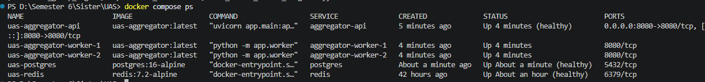

**Gambar 1.** Seluruh service aktif; API, PostgreSQL, dan Redis berstatus
healthy.

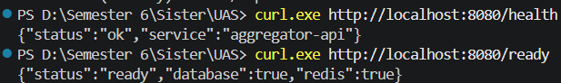

**Gambar 2.** Endpoint liveness dan readiness membuktikan koneksi API,
PostgreSQL, dan Redis.

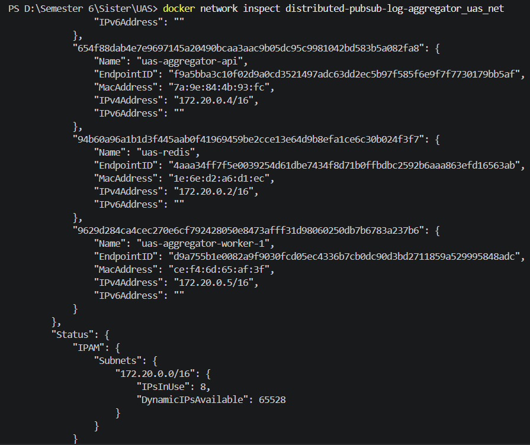

**Gambar 3.** Service berada pada jaringan lokal Docker Compose.

## 3.2 Model Event

Schema event minimal:

```json
{
  "topic": "auth.login",
  "event_id": "manual-001",
  "timestamp": "2026-06-11T10:00:00Z",
  "source": "manual-curl",
  "payload": {
    "user_id": "u001",
    "action": "login"
  }
}
```

Validasi yang diterapkan:

- `topic`: 1–100 karakter, hanya alfanumerik, `_`, `.`, dan `-`.
- `event_id`: 1–150 karakter.
- `timestamp`: ISO 8601 dan dinormalisasi ke UTC.
- `source`: 1–100 karakter.
- `payload`: JSON object.
- Batch: 1–1000 event.

## 3.3 Endpoint API

| Method | Endpoint | Fungsi |
|---|---|---|
| `GET` | `/health` | Liveness API |
| `GET` | `/ready` | Memeriksa PostgreSQL dan Redis |
| `POST` | `/publish` | Menerima single object atau array event |
| `POST` | `/publish/batch` | Alias batch lama, ditandai deprecated |
| `GET` | `/events` | Daftar event unik, opsional filter topic |
| `GET` | `/stats` | Counter global dan per-topic |
| `GET` | `/metrics` | Throughput dan kondisi antrean |

## 3.4 Model Data

| Tabel | Kunci/Invarian | Fungsi |
|---|---|---|
| `processed_events` | `UNIQUE(topic, event_id)` | Menyimpan event unik |
| `stats` | `PRIMARY KEY(name)` | Counter global |
| `topic_stats` | `PRIMARY KEY(topic)` | Counter unique/duplicate per topic |
| `audit_logs` | `BIGSERIAL id` | Riwayat processed, duplicate, dead-letter |

Payload disimpan sebagai `JSONB`, sedangkan timestamp producer disimpan sebagai
`TIMESTAMPTZ`. Kolom `processed_by` merekam worker yang memenangkan insert.

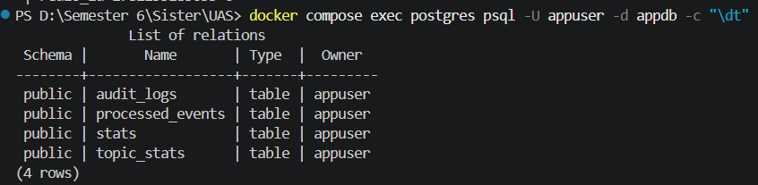

**Gambar 4.** Empat tabel persistent storage pada PostgreSQL.

---

# 4. Implementasi

## 4.1 Single Event Processing

`POST /publish` menerima object `EventIn`, menulis JSON ke Redis Stream dengan
`XADD`, lalu menaikkan counter `received` dan `stream_enqueued`. Respons
`202 Accepted` memuat topic, event ID, stream, dan Redis message ID.

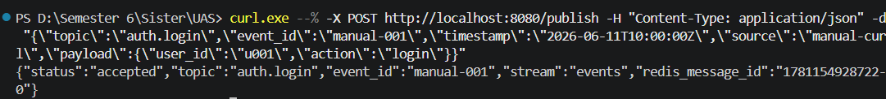

**Gambar 5.** API menerima event manual dan mengembalikan Redis message ID.

Worker membaca message melalui `XREADGROUP`, memvalidasi ulang schema, lalu
menjalankan `process_event`. Event yang selesai dapat diambil melalui
`GET /events`.

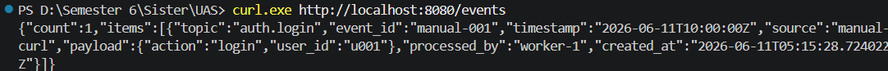

**Gambar 6.** Event unik tersedia pada endpoint `/events` setelah diproses
worker.

## 4.2 Idempotency dan Persistent Deduplication

SQL inti:

```sql
INSERT INTO processed_events (
    topic, event_id, event_timestamp, source, payload, processed_by
)
VALUES (...)
ON CONFLICT (topic, event_id)
DO NOTHING
RETURNING id;
```

Jika `RETURNING id` menghasilkan row, status adalah `processed`. Jika tidak,
status adalah `duplicate_dropped`. Keputusan tersebut dibuat PostgreSQL secara
atomik dan tetap berlaku untuk dua worker concurrent maupun delivery setelah
restart.

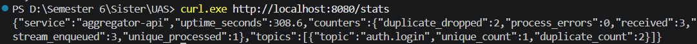

**Gambar 7.** Tiga delivery event yang sama menghasilkan satu unique dan dua
duplicate.

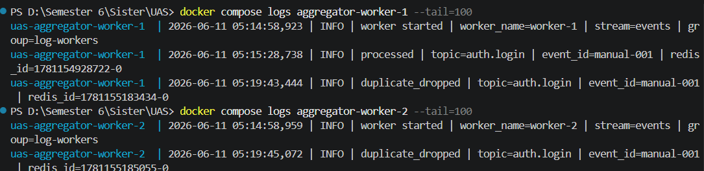

**Gambar 8.** Dua worker menerima delivery berbeda, tetapi duplicate ditolak
secara konsisten.

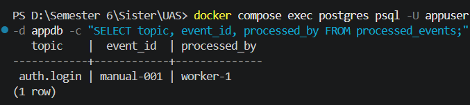

**Gambar 9.** PostgreSQL hanya menyimpan satu row untuk event identik.

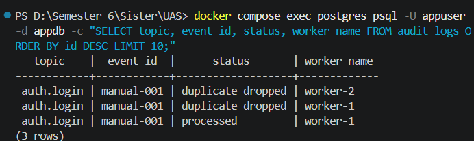

**Gambar 10.** Audit log mencatat satu `processed` dan dua
`duplicate_dropped`.

## 4.3 Transaction Boundary dan Atomic Counter

`process_event` membuka transaksi `READ COMMITTED`. Di dalam transaksi:

1. Worker mencoba insert event unik.
2. Worker menaikkan `unique_processed` atau `duplicate_dropped`.
3. Worker melakukan upsert `topic_stats`.
4. Worker menulis `audit_logs`.

Counter diperbarui dengan ekspresi database:

```sql
value = stats.value + delta
```

Pola tersebut mencegah lost update. Jika salah satu statement gagal, semua
perubahan rollback dan Redis message belum di-ACK.

## 4.4 Batch Processing

Endpoint utama `/publish` menerima object atau array. API menggunakan Redis
pipeline untuk menambahkan seluruh event batch, lalu memperbarui counter
berdasarkan panjang batch. Batch demo berisi tiga event, dua event ID unik,
dan satu duplicate.

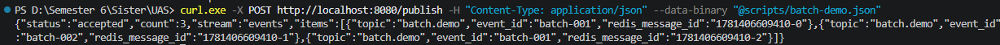

**Gambar 11.** Endpoint utama menerima tiga event dalam satu request batch.

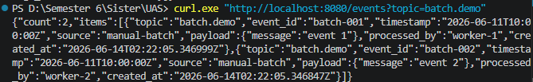

**Gambar 12.** Hanya dua event unik terlihat pada query topic batch.

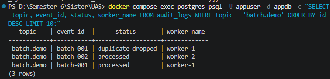

**Gambar 13.** Audit batch menunjukkan dua `processed` dan satu
`duplicate_dropped`.

Kebijakan batch adalah partial asynchronous acceptance pada broker: seluruh
schema array divalidasi sebelum handler berjalan, tetapi setiap item menjadi
message Redis tersendiri dan diproses dalam transaksi database masing-masing.
Kebijakan ini mempertahankan throughput dan isolasi kegagalan antar-item.

## 4.5 Retry, Pending Recovery, dan Dead-Letter

Worker memiliki konfigurasi:

- `MAX_RETRIES=3`
- `RETRY_BACKOFF_BASE_SECONDS=0.5`
- `PENDING_IDLE_MS=10000`
- `READ_COUNT=10`

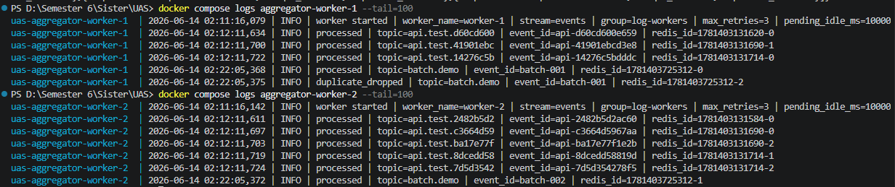

**Gambar 14.** Kedua worker aktif dengan retry dan pending recovery.

Jika `process_event` gagal, worker tidak mengirim `XACK`. Retry count disimpan
pada Redis hash. Message tetap pending dan setelah idle 10 detik dapat
diklaim oleh worker yang sama atau worker lain menggunakan `XAUTOCLAIM`.
Backoff dihitung sebagai `base * 2^(attempt-1)`. Pada attempt ketiga, worker
menulis message ke `events:deadletter`, menambah counter `process_errors` dan
`dead_lettered`, menulis audit log, lalu mengirim ACK agar poison message
tidak berulang tanpa batas.

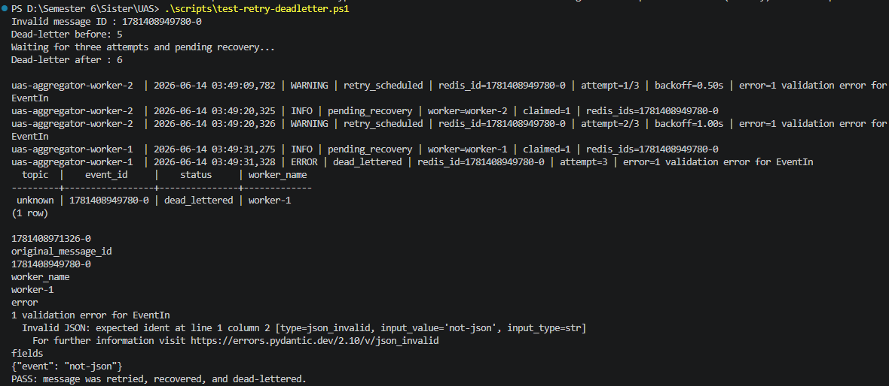

**Gambar 15.** Fault injection memperlihatkan attempt 1–3, pending recovery
lintas worker, dead-letter, audit database, dan status PASS.

## 4.6 Persistence

PostgreSQL menggunakan named volume:

```yaml
volumes:
  - pg_data:/var/lib/postgresql/data
```

Redis menggunakan `redis_data:/data` dan AOF. Uji persistence membuat marker
event, memastikan row tersedia, menjalankan `docker compose up -d
--force-recreate postgres`, menunggu healthcheck, kemudian menghitung marker
yang sama.

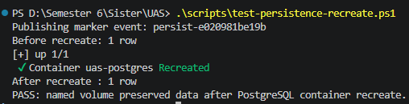

**Gambar 16.** Jumlah marker tetap satu sebelum dan sesudah container
PostgreSQL di-recreate.

## 4.7 Observability

Observability terdiri dari:

- Structured log dengan worker, topic, event ID, Redis ID, dan status.
- Audit log persisten.
- `/health` dan `/ready`.
- `/stats` untuk counter global/per-topic.
- `/metrics` untuk rate dan queue state.

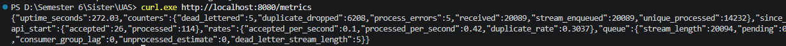

**Gambar 17.** Metrics menampilkan throughput, duplicate rate, pending,
consumer-group lag, unprocessed estimate, dan dead-letter length.

Nilai `process_errors` dan `dead_lettered` pada gambar berasal dari intentional
fault injection untuk membuktikan recovery, bukan error pada load test normal.

## 4.8 Docker, Jaringan, dan Security

Application image menggunakan `python:3.11-slim`, dependency version tetap,
dan user non-root. PostgreSQL dan Redis tidak diekspos ke host. API menjadi
satu-satunya entry point pada `localhost:8080`. Compose healthcheck dan
`service_healthy` mengurangi startup race. Konfigurasi database saat ini
memakai credential demonstrasi di Compose; untuk deployment produksi,
credential harus dipindahkan ke secret manager atau Docker secrets.

---

# 5. Pengujian

## 5.1 Strategi Pengujian

Pengujian dibagi menjadi:

1. Unit test untuk schema validation dan helper worker.
2. Repository integration test menggunakan PostgreSQL.
3. HTTP integration test terhadap API dan worker aktual.
4. Concurrency test.
5. Host integration script untuk recreate dan Redis fault injection.
6. Load test k6.

## 5.2 Hasil Pytest

| Kelompok | Jumlah | Fokus |
|---|---:|---|
| API | 9 | Health, ready, single, batch, events, stats, metrics |
| Concurrency | 2 | Duplicate race dan unique parallel events |
| Dedup repository | 3 | Unique, duplicate, satu row |
| Event validation | 6 | Topic, ID, timestamp, payload |
| Persistence reconnect | 1 | Data tersedia melalui pool baru |
| Stats | 3 | Counter global dan topic |
| Worker idempotency | 2 | Repeated processing dan audit |
| Retry/pending | 4 | ACK, no ACK on fail, dead-letter, XAUTOCLAIM |
| **Total** | **30** | **Seluruh test lulus** |

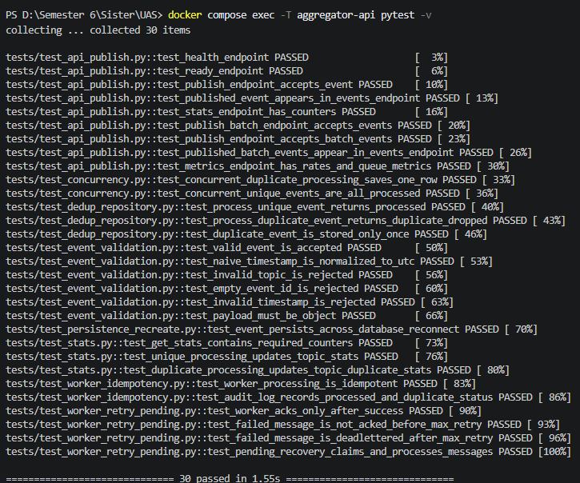

**Gambar 18.** Seluruh 30 test lulus dalam sekitar 1,55 detik.

## 5.3 Uji Konkurensi

Test `test_concurrent_duplicate_processing_saves_one_row` menjalankan 20
coroutine terhadap object event yang sama. Ekspektasi dan hasilnya:

```text
processed             = 1
duplicate_dropped     = 19
processed_events rows = 1
```

Test `test_concurrent_unique_events_are_all_processed` mengirim 10 event unik
secara bersamaan dan menghasilkan 10 row. Kedua hasil membuktikan bahwa unique
constraint tidak menghambat event berbeda, tetapi mencegah race event identik.

## 5.4 Uji Crash/Retry

Test unit memastikan message gagal sebelum max retry tidak di-ACK. Fault
injection Redis nyata memasukkan payload `not-json`. Message pertama kali
diterima worker-2, tetap pending, kemudian diklaim dan akhirnya
dead-lettered oleh worker-1. Perpindahan worker membuktikan recovery tidak
bergantung pada consumer awal.

## 5.5 Uji Persistence

Test pytest memverifikasi data tetap tersedia setelah database pool ditutup
dan dibuat ulang. Script host melengkapi test dengan recreate container
PostgreSQL sebenarnya. Volume tidak dihapus, sehingga row marker tetap ada.
Pengujian sengaja tidak memakai `docker compose down -v` karena opsi `-v`
memang diperuntukkan menghapus volume beserta data.

---

# 6. Pengujian Performa

## 6.1 Skenario k6

Konfigurasi:

| Parameter | Nilai |
|---|---:|
| Total request | 20.000 |
| Unique event | 14.000 |
| Duplicate event | 6.000 |
| Duplicate ratio | 30% |
| Virtual users | 20 |
| Executor | `shared-iterations` |
| Maximum duration | 5 menit |
| Threshold failure | `< 1%` |
| Threshold p95 | `< 1.000 ms` |

Unique index untuk 6.000 request terakhir diarahkan kembali ke 14.000 ID awal,
sehingga duplicate ratio deterministik dan dapat diverifikasi di database.

## 6.2 Hasil

| Metrik | Hasil |
|---|---:|
| Completed iterations | 20.000 |
| Checks | 100% |
| HTTP request failed | 0,00% |
| Throughput request | ±341 request/detik |
| Average HTTP duration | 47,68 ms |
| p90 HTTP duration | 74,54 ms |
| p95 HTTP duration | 89,38 ms |
| Maximum HTTP duration | 312,61 ms |
| Total waktu | ±58,6 detik |

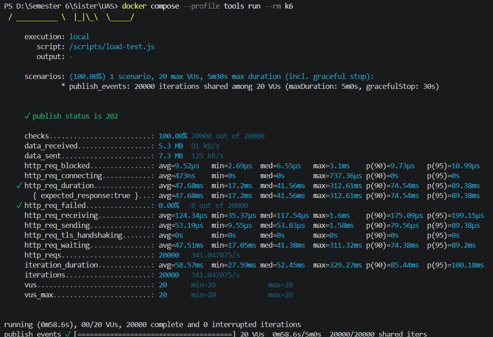

**Gambar 19.** k6 menyelesaikan 20.000 iterations dengan 100% check dan 0%
request failure.

## 6.3 Verifikasi Correctness Setelah Load Test

Endpoint `/stats` menunjukkan:

```text
received          = 20000
stream_enqueued   = 20000
unique_processed  = 14000
duplicate_dropped = 6000
process_errors    = 0
```

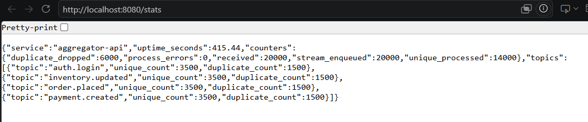

**Gambar 20.** Statistik setelah load test sesuai komposisi 70% unique dan 30%
duplicate.

Query database menghitung 14.000 event unik berdasarkan prefix run:

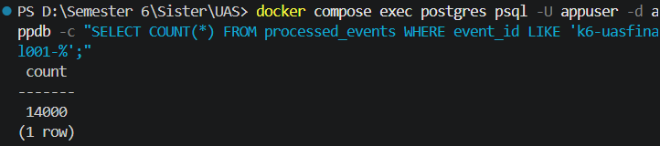

**Gambar 21.** PostgreSQL berisi tepat 14.000 event unik untuk run k6.

Audit log menunjukkan 14.000 `processed` dan 6.000 `duplicate_dropped`:

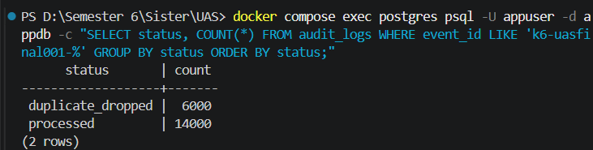

**Gambar 22.** Audit database membuktikan seluruh 20.000 delivery
terklasifikasi tanpa kehilangan event.

## 6.4 Parallel Worker

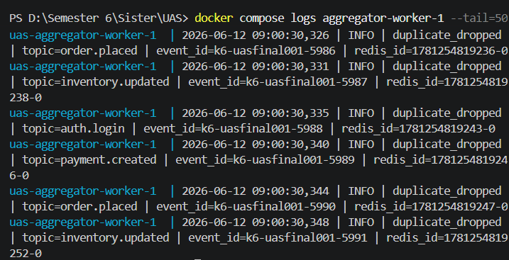

**Gambar 23.** Worker-1 memproses message dari consumer group.

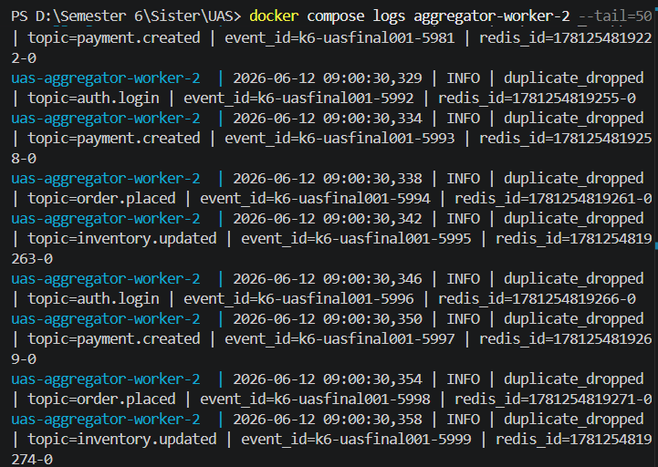

**Gambar 24.** Worker-2 memproses message pada waktu yang sama.

Kedua gambar membuktikan workload tidak hanya dijalankan satu worker. Consumer
group membagi message ke dua process, sedangkan unique constraint
mempertahankan konsistensi ketika duplicate diproses secara parallel.

---

# 7. Analisis Hasil

Implementasi memenuhi spesifikasi API, persistent deduplication,
idempotency, transaction, concurrency control, persistence, dan minimum
performance. Hasil 14.000 unique dan 6.000 duplicate sama pada `/stats`,
database, dan audit log. Kesamaan tiga sumber observasi menunjukkan tidak ada
lost update atau unclassified delivery pada load test.

Unique constraint terbukti lebih kuat dibanding application-level duplicate
check. Dua worker dapat berjalan tanpa distributed lock, dan test concurrency
tetap menghasilkan satu row. Transaction boundary juga memastikan counter
serta audit mengikuti keputusan insert. Penggunaan `READ COMMITTED` cukup
karena invariant tidak bergantung pada repeated read.

Reliability diuji pada dua tingkat. Unit test memeriksa aturan ACK dan retry
secara deterministik, sedangkan fault injection membuktikan pending message
dapat berpindah consumer dan masuk dead-letter. Persistence recreate
membuktikan data tidak terikat pada lifecycle container.

Keterbatasan utama adalah Redis Stream belum menerapkan retention (`MAXLEN`),
sehingga stream dapat terus membesar. Dead-letter belum memiliki reprocessing
endpoint. Metrics bersifat application snapshot dan belum diekspor dalam
format Prometheus. Strict ordering, broker/database replication, TLS,
authentication, dan secret management juga belum diterapkan. Keterbatasan
tersebut tidak mengubah correctness ruang lingkup tugas, tetapi menjadi
pekerjaan lanjutan untuk deployment production.

---

# 8. Kesimpulan

Distributed Pub-Sub Log Aggregator berhasil dibangun sebagai sistem
multi-service lokal menggunakan Docker Compose. Redis Streams memisahkan
publisher dan consumer, sedangkan PostgreSQL menyediakan durable source of
truth. Kombinasi unique constraint `(topic, event_id)`, `ON CONFLICT`,
transaction `READ COMMITTED`, atomic counter, dan ACK setelah commit
menghasilkan idempotent processing yang tahan race condition.

Sistem mendukung single dan batch publish, dua worker paralel, retry,
exponential backoff, pending recovery, dead-letter, persistent volume,
healthcheck, readiness, logging, audit, dan metrics. Seluruh 30 automated
tests lulus. Load test 20.000 event dengan 30% duplikat menghasilkan 14.000
event unik dan 6.000 duplicate dropped, 100% check sukses, 0% HTTP failure,
serta p95 sekitar 89,38 ms. Container PostgreSQL dapat di-recreate tanpa
kehilangan marker event.

Hasil tersebut menunjukkan tujuan tugas tercapai: event duplicate tidak
diproses sebagai row baru, pemrosesan concurrent tetap konsisten, dan data
bertahan melewati lifecycle application container. Desain juga memiliki batas
jaminan yang eksplisit, yaitu at-least-once delivery dengan exactly-once
persistent effect melalui idempotency.

---

# Daftar Pustaka

Amazon Web Services. (2024). *Transactional outbox pattern*. AWS Prescriptive
Guidance. Retrieved June 17, 2026, from
https://docs.aws.amazon.com/prescriptive-guidance/latest/cloud-design-patterns/transactional-outbox.html

Davis, K., Peabody, B., & Leach, P. (2024). *Universally unique identifiers
(UUIDs)* (RFC 9562). RFC Editor. https://www.rfc-editor.org/info/rfc9562

Docker, Inc. (2026a). *Control startup and shutdown order in Compose*. Docker
Documentation. Retrieved June 17, 2026, from
https://docs.docker.com/compose/how-tos/startup-order/

Docker, Inc. (2026b). *Volumes*. Docker Documentation. Retrieved June 17,
2026, from https://docs.docker.com/engine/storage/volumes/

Google Cloud. (2026a). *Subscription overview*. Google Cloud Documentation.
Retrieved June 17, 2026, from
https://docs.cloud.google.com/pubsub/docs/subscription-overview

Google Cloud. (2026b). *Exactly-once delivery*. Google Cloud Documentation.
Retrieved June 17, 2026, from
https://docs.cloud.google.com/pubsub/docs/exactly-once-delivery

Microsoft. (2026a). *Publisher-Subscriber pattern*. Microsoft Learn. Retrieved
June 17, 2026, from
https://learn.microsoft.com/en-us/azure/architecture/patterns/publisher-subscriber

Microsoft. (2026b). *Asynchronous messaging options*. Microsoft Learn.
Retrieved June 17, 2026, from
https://learn.microsoft.com/en-us/azure/architecture/guide/technology-choices/messaging

OpenTelemetry Authors. (2026). *Observability primer*. OpenTelemetry
Documentation. Retrieved June 17, 2026, from
https://opentelemetry.io/docs/concepts/observability-primer/

PostgreSQL Global Development Group. (2026a). *Transaction isolation*.
PostgreSQL 18 Documentation. Retrieved June 17, 2026, from
https://www.postgresql.org/docs/current/transaction-iso.html

PostgreSQL Global Development Group. (2026b). *INSERT*. PostgreSQL 18
Documentation. Retrieved June 17, 2026, from
https://www.postgresql.org/docs/current/sql-insert.html

Redis Ltd. (2026b). *XAUTOCLAIM*. Redis Documentation. Retrieved June 17,
2026, from https://redis.io/docs/latest/commands/xautoclaim/

---

# Lampiran A. Cara Menjalankan

```powershell
docker compose up --build -d postgres redis aggregator-api aggregator-worker-1 aggregator-worker-2
docker compose ps
```

Akses API:

```text
http://localhost:8080
```

Menjalankan test:

```powershell
docker compose exec -T aggregator-api pytest -v
```

Menjalankan k6:

```powershell
docker compose --profile tools run --rm k6
```

Uji persistence:

```powershell
.\scripts\test-persistence-recreate.ps1
```

Uji retry/dead-letter:

```powershell
.\scripts\test-retry-deadletter.ps1
```

# Lampiran B. Struktur Repository

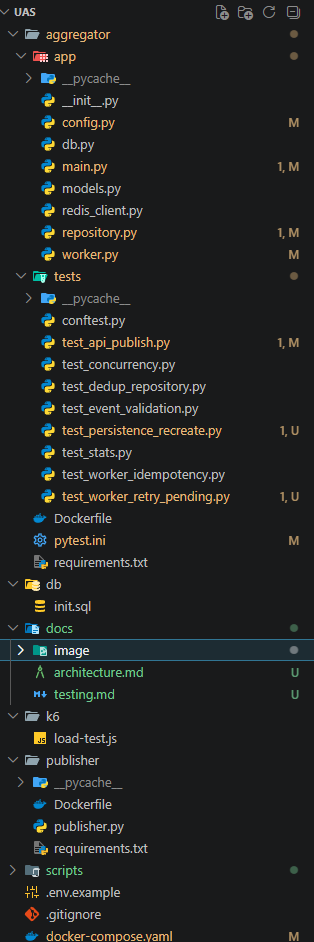

**Gambar 25.** Struktur repository final.

```text
aggregator/          FastAPI, worker, repository, dan tests
publisher/           Simulator publisher
db/                  Inisialisasi schema PostgreSQL
k6/                  Load test 20.000 event
scripts/             Demo dan integration scripts
docs/                Dokumentasi, laporan, dan bukti gambar
docker-compose.yaml  Orkestrasi service
README.md            Instruksi project
```
